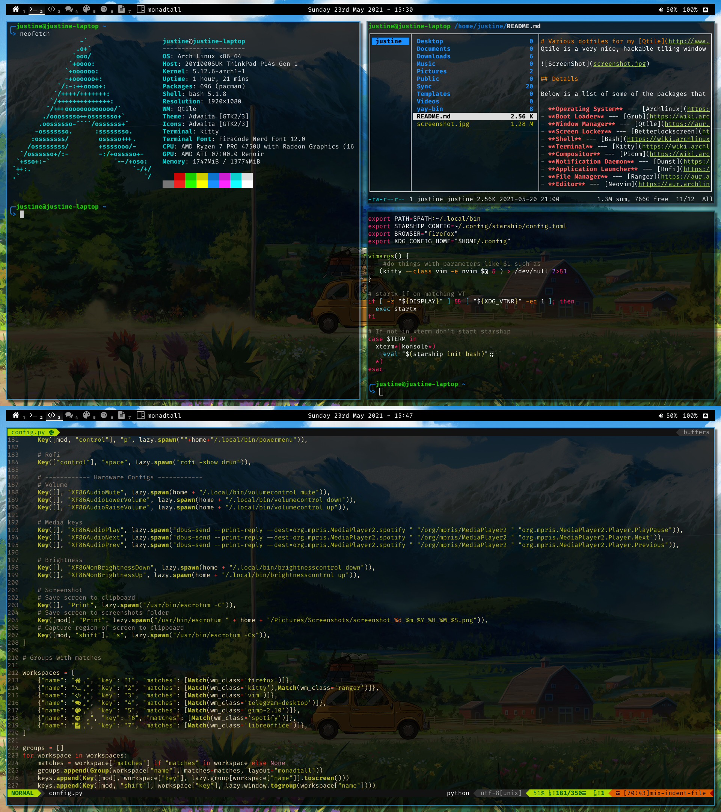

# Various dotfiles for my [Qtile](http://www.qtile.org/) setup.
Qtile is a very nice, hackable tiling window manager written and configured in Python.

## :page_facing_up: Details

Below is a list of some of the packages that I use for my current setup.

- [**Operating System**](https://en.wikipedia.org/wiki/Operating_system) --- [Archlinux](https://www.archlinux.org/)
- [**Boot Loader**](https://wiki.archlinux.org/index.php/Arch_boot_process#Boot_loader) --- [Grub](https://wiki.archlinux.org/index.php/GRUB)
- [**Window Manager**](https://wiki.archlinux.org/index.php/Window_manager) --- [qtile](https://aur.archlinux.org/packages/qtile-git)
- [**Screen Locker**](https://wiki.archlinux.org/index.php/List_of_applications/Security#Screen_lockers) --- [Betterlockscreen](https://aur.archlinux.org/packages/betterlockscreen)
- [**Shell**](https://wiki.archlinux.org/index.php/Command-line_shell) --- [Bash](https://wiki.archlinux.org/index.php/Bash) using [Starship](https://aur.archlinux.org/packages/starship-git/) 
- [**Terminal**](https://wiki.archlinux.org/index.php/List_of_applications/Utilities#Terminal_emulators) --- [Kitty](https://wiki.archlinux.org/index.php/Kitty)
- [**Compositor**](https://wiki.archlinux.org/index.php/Xorg#Composite) --- [Picom](https://wiki.archlinux.org/index.php/Picom)
- [**Notification Daemon**](https://wiki.archlinux.org/index.php/Desktop_notifications) --- [Dunst](https://wiki.archlinux.org/index.php/Dunst)
- [**Application Launcher**](https://wiki.archlinux.org/index.php/List_of_applications/Other#Application_launchers) --- [Rofi](https://wiki.archlinux.org/index.php/Rofi)
- [**File Manager**](https://wiki.archlinux.org/index.php/File_manager_functionality) --- [Ranger](https://aur.archlinux.org/packages/ranger-git)
- [**Text Editor**](https://wiki.archlinux.org/index.php/List_of_applications#Text_editors) --- [Neovim](https://aur.archlinux.org/packages/neovim-git)
...[**Neovim Plugins**]()
- [**Web Browser**](https://wiki.archlinux.org/index.php/List_of_applications/Internet#Web_browsers) --- [Firefox](https://wiki.archlinux.org/index.php/Firefox)

## Keybindings
### Window manager controls
| Keys                      | Action                    |
| ------------------------- | ------------------------- |
| CTRL + MOD + r            | restart Qtile             |
| CTRL + MOD + q            | shutdown Qtile            |
| MOD + w                   | kill window               |
| MOD + r                   | spawn program             |
| MOD + RETURN              | spawn terminal            |
| CTRL + SPACE              | Rofi menu                  |
| CTRL + MOD + p            | Rofi power menu            |
