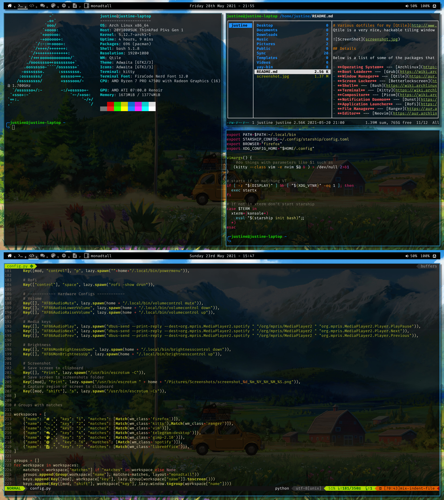

# Various dotfiles for my [Qtile](http://www.qtile.org/) setup.
Qtile is a very nice, hackable tiling window manager written and configured in Python.

## :page_facing_up: Details

Below is a list of some of the packages that I use for my current setup.

- **Operating System** --- [Archlinux](https://www.archlinux.org/)
- **Boot Loader** --- [Grub](https://wiki.archlinux.org/index.php/GRUB)
- **Window Manager** --- [qtile](https://aur.archlinux.org/packages/qtile-git)
- **Screen Locker** --- [Betterlockscreen](https://aur.archlinux.org/packages/betterlockscreen)
- **Shell** --- [Bash](https://wiki.archlinux.org/index.php/Bash) using [Starship](https://aur.archlinux.org/packages/starship-git/) 
- **Terminal** --- [Kitty](https://wiki.archlinux.org/index.php/Kitty)
- **Compositor** --- [Picom](https://wiki.archlinux.org/index.php/Picom)
- **Notification Daemon** --- [Dunst](https://wiki.archlinux.org/index.php/Dunst)
- **Application Launcher** --- [Rofi](https://wiki.archlinux.org/index.php/Rofi)
- **File Manager** --- [Ranger](https://aur.archlinux.org/packages/ranger-git)
- **Editor** --- [Neovim](https://aur.archlinux.org/packages/neovim-git)
  - **Plugins**
- **Web Browser** --- [Firefox](https://wiki.archlinux.org/index.php/Firefox)

## Keybindings
### Window manager controls
| Keys                      | Action                    |
| ------------------------- | ------------------------- |
| CTRL + MOD + r            | restart Qtile             |
| CTRL + MOD + q            | shutdown Qtile            |
| MOD + w                   | kill window               |
| MOD + r                   | spawn program             |
| MOD + RETURN              | spawn terminal            |
| CTRL + SPACE              | Rofi menu                  |
| CTRL + MOD + p            | Rofi power menu            |
